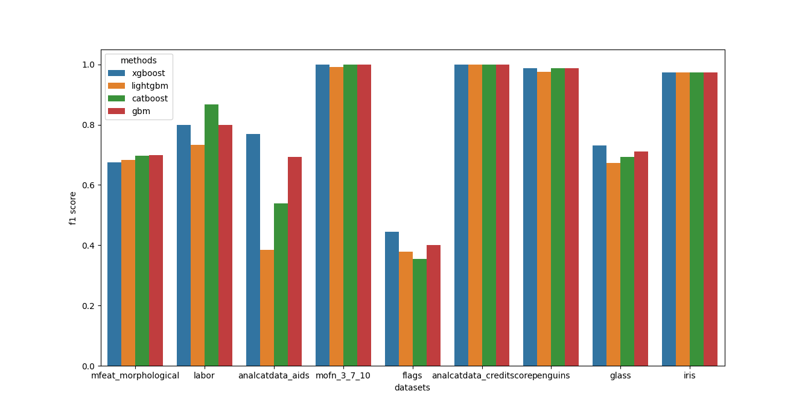

[](https://github.com/psf/black)
[](https://mlgauge.readthedocs.io/en/latest/?badge=latest)
 [](https://opensource.org/licenses/MIT)

A simple library to benchmark performance of machine learning methods across different datasets. mlgauge is also a wrapper around [PMLB](https://github.com/EpistasisLab/pmlb) and [OpenML](https://www.openml.org/) which provide benchmark datasets for machine learning.

mlgauge can help you if
* You are developing a machine learning method or an automl system and want to compare and analyze how it performs against other methods.
* You are learning different machine learning methods and would like to understand how different methods behave under different conditions.

Checkout the [documentation](https://mlgauge.readthedocs.io/) to learn more.


## Installation

```
pip install mlgauge
```

## Usage

This is the workflow for setting up and running a comparison benchmark with mlgauge:
1. Set up your methods by defining a `Method` class. If your method follows the sklearn API, you can directly use the `SklearnMethod` which provides a typical sklearn workflow for estimators.
2. Set up the experiments with the `Analysis` class.
3. Collect the results for further comparative analysis.


### Example

```python
from mlgauge import Analysis, SklearnMethod
from xgboost import XGBClassifier
from lightgbm import LGBMClassifier
from catboost import CatBoostClassifier
from sklearn.ensemble import GradientBoostingClassifier
import matplotlib.pyplot as plt

SEED = 42

methods = [
    ("xgboost", SklearnMethod(XGBClassifier(n_jobs=-1,verbose=0), ["accuracy", "f1_micro"])),
    ("lightgbm", SklearnMethod(LGBMClassifier(n_jobs=-1,verbose=0), ["accuracy", "f1_micro"])),
    ("catboost", SklearnMethod(CatBoostClassifier(thread_count=-1,verbose=0), ["accuracy", "f1_micro"])),
    ("gbm", SklearnMethod(GradientBoostingClassifier(verbose=0), ["accuracy", "f1_micro"])),
]

an = Analysis(
    methods=methods,
    metric_names=["accuracy", "f1 score"],
    datasets="classification",
    n_datasets=10,
    random_state=SEED,
)
an.run()

print(an.get_result_as_df("f1 score"))
```

```
                          xgboost  lightgbm  catboost       gbm
datasets
mfeat_morphological      0.674000  0.682000  0.698000  0.700000
labor                    0.800000  0.733333  0.866667  0.800000
analcatdata_aids         0.769231  0.384615  0.538462  0.692308
mofn_3_7_10              1.000000  0.990937  1.000000  1.000000
flags                    0.444444  0.377778  0.355556  0.400000
analcatdata_creditscore  1.000000  1.000000  1.000000  1.000000
mfeat_morphological      0.674000  0.682000  0.698000  0.700000
penguins                 0.988095  0.976190  0.988095  0.988095
glass                    0.730769  0.673077  0.692308  0.711538
iris                     0.973684  0.973684  0.973684  0.973684
```

```python
an.plot_results("f1 score")
```



More examples are available in the [documentation](https://mlgauge.readthedocs.io/).

## Credits

Logo designed by the talented [Neha Balasundaram](https://www.behance.net/nehabalasundaram).
