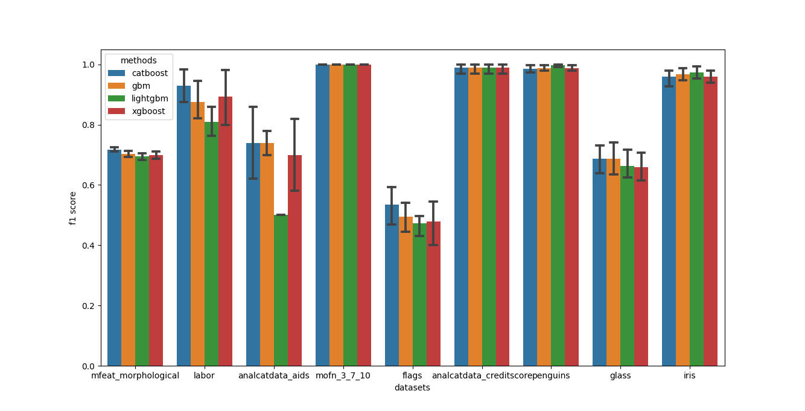

Sklearn examples
================

The ``SklearnMethod`` provides an interface to use sklearn compatible estimators.

Simple example
--------------

This is a simple example of comparing different boosting models with their default configurations for classification tasks:

.. literalinclude:: ../../examples/boosting.py

**Output:**

.. code-block:: none
   :caption: output
   :name: output

                              xgboost  lightgbm  catboost       gbm
    datasets
    mfeat_morphological      0.674000  0.682000  0.698000  0.700000
    labor                    0.800000  0.733333  0.866667  0.800000
    analcatdata_aids         0.769231  0.384615  0.538462  0.692308
    mofn_3_7_10              1.000000  0.990937  1.000000  1.000000
    flags                    0.444444  0.377778  0.355556  0.400000
    analcatdata_creditscore  1.000000  1.000000  1.000000  1.000000
    mfeat_morphological      0.674000  0.682000  0.698000  0.700000
    penguins                 0.988095  0.976190  0.988095  0.988095
    glass                    0.730769  0.673077  0.692308  0.711538
    iris                     0.973684  0.973684  0.973684  0.973684

.. image:: ../examples/images/boosting.png
   :alt: metric plot

Modifying the code to use 5-fold validation (default) instead of a train-test split by setting the ``use_test_set`` parameter of analysis to ``False`` gives the following output:

.. code-block:: none
   :caption: output-cv
   :name: output-cv

                              xgboost            ...       gbm
                                 mean       std  ...      mean       std
    datasets                                     ...
    mfeat_morphological      0.698500  0.019468  ...  0.703500  0.015540
    labor                    0.893939  0.104094  ...  0.875758  0.070678
    analcatdata_aids         0.700000  0.141421  ...  0.740000  0.048990
    mofn_3_7_10              1.000000  0.000000  ...  1.000000  0.000000
    flags                    0.478413  0.084229  ...  0.494921  0.053567
    analcatdata_creditscore  0.990000  0.020000  ...  0.990000  0.020000
    mfeat_morphological      0.698500  0.019468  ...  0.703500  0.015540
    penguins                 0.988014  0.011182  ...  0.987969  0.011315
    glass                    0.658537  0.057718  ...  0.687805  0.062470
    iris                     0.960000  0.024944  ...  0.966667  0.021082

